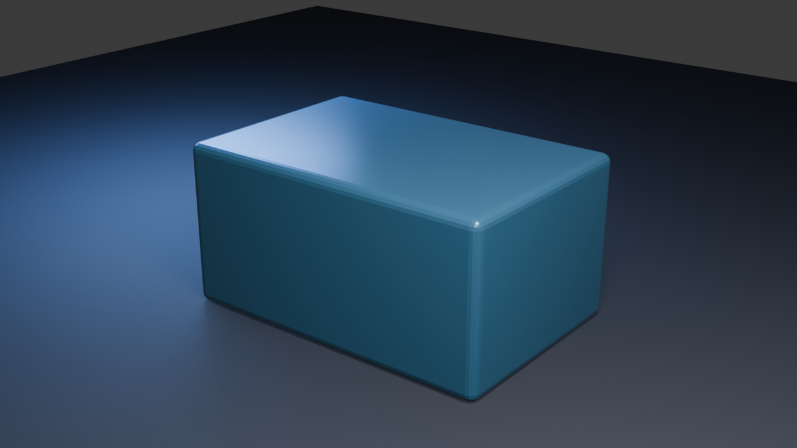

# Kairo Blender Bridge

Kairo Blender Bridge is an artist-facing Blender extension for validating and
publishing production assets into the Kairo asset pipeline. It is one part of
the multi-DCC Kairo Production Tools portfolio.



## Current verified host

- Blender 5.2.0 LTS
- Bundled Python 3.13.13
- macOS Apple Silicon

## Native development smoke test

```bash
/Applications/Blender.app/Contents/MacOS/Blender \
  --background --factory-startup \
  --python tests/run_blender_tests.py
```

The initial increment registers an installable extension panel and persistent
scene settings. The current vertical slice validates a static asset, navigates
and safely fixes supported problems, exports separate glTF, fingerprints every
payload, supports dry-run planning, and publishes through an atomic rename.

## Build an installable extension

```bash
python3 scripts/build_extension.py \
  --core-source ../KairoPipelineCore \
  --blender /Applications/Blender.app/Contents/MacOS/Blender
```

This builds the pinned `KairoPipelineCore` wheel and packages it inside
`dist/kairo_blender-0.1.0.zip`. Generated wheels and packages are deliberately
excluded from Git; CI publishes the ready-to-install zip as an artifact.

## Reproduce the portfolio scene

After installing and enabling the extension:

```bash
/Applications/Blender.app/Contents/MacOS/Blender \
  --background --python examples/create_portfolio_scene.py
```

The script creates a redistributable scene from primitives, validates the
selected asset with zero diagnostics, saves the `.blend` inside a temporary
portfolio project, and renders the documented 1280×720 result.

See [the artist workflow](docs/ARTIST_WORKFLOW.md) for validation, safe fixes,
dry-run behavior, publication, and failure recovery.
